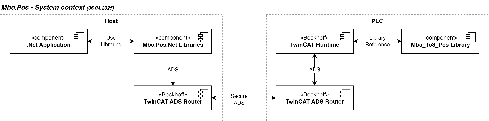
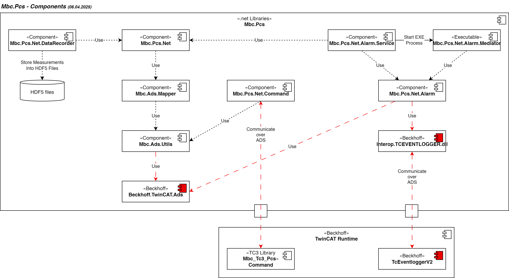

# MBC PCS Library
## Intro
This Library will help to interact with a Beckhoff PLC that is running as a Process Control System (PCS) with TwinCat 3.1 over a ADS router. There are some default exchange logic and structures for reuse. This Library is split into two parts, one for the .NET side an the other for the PCS side, also known as PLC, it help you on some point. Example on handling PCS commands, recording measurement data, and handling alarms.

## Overview




## Documentations

**.NET Library**
- For [documentation MBC.PCS.NET](NET/readme.md)
- This library is based on the [TC1000 | TwinCAT ADS.NET V6](https://infosys.beckhoff.com/index.php?content=../content/1033/tc3_ads.net/index.html&id=207622008965200265) .net Library from Beckhoff.
- [changelog .net libraries](NET/Changelog.md)

**TwinCAT Library**
- For [documentation of MBC.Tc3.PCS](TwinCat/Mbc.Tc3.Pcs/Mbc_Tc3_Pcs/docs/Readme.md)
- [changelog TwinCAT Library](TwinCat/Mbc.Tc3.Pcs/Mbc_Tc3_Pcs/docs/changelog.md)

## Requirements to use the Library
- Installed [ADS Router - TC1000 | TC3 ADS](https://www.beckhoff.com/de-de/support/downloadfinder/suchergebnis/?download_group=97028369) on the .Net side. This is required to connect to the TwinCat PLC over ADS. 
- Configured ADS Router between the .Net application Host and the PLC. This is required to connect to the TwinCat PLC over ADS. Use Secure ADS!
- TwinCAT Version >= 4024.10

> I recommend to use the library as submodule in your project. This is the easiest way to use the library. Publishing the library as a nuget package is a lot of work and we have stopped it.
>
> Add the submodule to your project with the following command: git submodule add https://github.com/mbc-engineering/net-pcs.git src/submodules/
>
> or add it manually to your `.gitmodules` file:
> ```
> [submodule "net-pcs"]
> path = src/submodules/net-pcs
> url = https://github.com/mbc-engineering/net-pcs.git
> branch = master
> ```

## Build
### Requirements
- .Net Framework >= 4.7.1, .net 8.0
- Visual Studio 2022
- [TwinCat 3.1 4024 or newer](https://www.beckhoff.com/de-de/support/downloadfinder/suchergebnis/?download_group=725136885)

### Build Steps
Clone repository and build 
- `dotnet build .\NET\Mbc.Pcs.Net.sln`
- `TwinCat\Mbc.Tc3.Pcs.sln` with TwinCat 3.1

### deployment

For Deployment of the .Net nuget packages there is a Cake Build script. 

```powershell
> cd NET
# Unit Tests
..\NET>  .\build.ps1 -t Test

# Publish nuget
..\NET>  .\build.ps1 --target=NugetPublish --apikey=[xxxxxxxx]
```

## How to create Nuget packages for a Mbc.Pcs.Net.TwinCat.EventLog and push to Server

_First:_ 
- Copy the new `Interop.TCEVENTLOGGERLib.dll` and `Interop.TcEventLogProxyLib.dll` to the `Libs` folder.
- Update the `Build\Mbc.Pcs.Net.TwinCat.EventLog.nuspec` file with the correct version.

_Second:_ Run the [cake build](https://cakebuild.net/) Script `> .\build.ps1 --target=NugetPush --nuspec="Build\Mbc.Pcs.Net.TwinCat.EventLog.nuspec" --apikey=[xxxxxxxx]`. This build the nuspec configuration to a package and push it to the `mbcpublic` feed defined `NET\NuGet.Config`.

## How to create Mbc_Tc3_Pcs TC3 library
_First:_ In the File `Mbc_Tc3_Pcs` project increment the Project Version number.

_Second:_ In the subnote of `Mbc_Tc3_Pcs` right click on the node `Mbc_Tc3_Pcs Project` and select Save as library and install. Save the generated library unter `TwinCat\Mbc.Tc3.Pcs\Library` with the following name `Mbc_Tc3_Pcs_vx.x.x.x.library` (replace x with the Project Version number).

_Third:_ Commit the created library to git and create a git tag with the name `Mbc_Tc3_Pcs/vx.x.x.x`.

## Contribute

Feel free to contribute! After review it will merged into de main branch.

Please write your changes to the TwinCAT Library MBC.Tc3.PCS into the [changelog](TwinCat/Mbc.Tc3.Pcs/Mbc_Tc3_Pcs/docs/changelog.md).

## License
    This library was created by a company formerly known as mbc engineering, from Switzerland. This company used this library for their projects. After the split, we decided to release this library as open source.

    Licensed under the Apache License, Version 2.0

[Read the full license](https://www.apache.org/licenses/LICENSE-2.0)